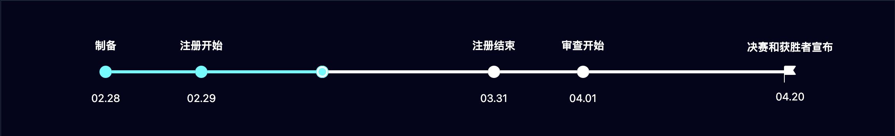
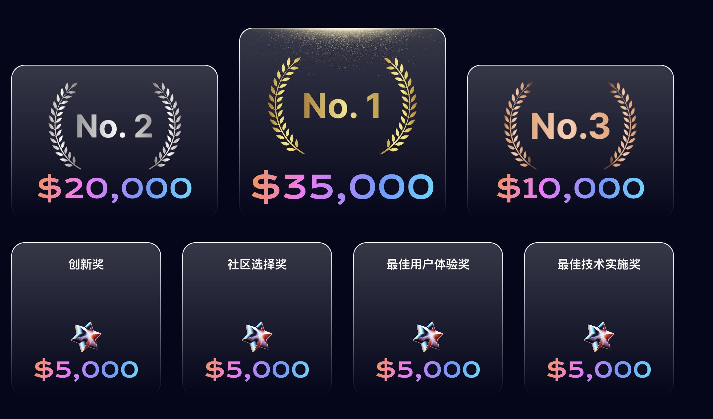

# DeAi 黑客松

# 简介

由 EMC（Edge Matrix Computing）发起的 DeAI Hackathon 2024 是一项全球在线黑客马拉松!

报名入口: https://build.bewater.xyz/en/campaigns/QK6e-DeAI-Hackathon-2024-EMC

专注于促进 AI 应用程序与 web3 技术的创新和集成。

该黑客马拉松提供高达 100 万美元的奖金、计算资源和资金支持，旨在推动 EMC 生态系统中 AI 应用程序和产品的开发和实施。

对于那些希望将 AI 技术与 web3 相结合的人来说，

DeAI Hackathon 是一个理想的平台和合作伙伴。 黑客马拉松将主要涵盖基于文本、视觉应用程序和生成式 AI 等项目。

⏰ 作品提交时间:

# 奖项

# 评审维度

### 创新:
我们的重点是通过人工智能和 Web3 技术的新应用来解决现实世界的挑战或改善现有情况的项目。
参与者必须明确定义他们的项目所解决的具体问题、目标用户群以及他们的解决方案如何在原创性和实用性方面脱颖而出。

### 技术能力：
在您的项目中展示重要的技术成就，或概述您的实施计划以创造竞争优势至关重要。这些优势的例子可能包括为检索增强生成 （RAG） 组装大量、高质量、特定于领域的数据集，或对大型语言模型 （LLM） 进行复杂的微调。
仅仅部署一个开源的LLM并不构成一个独特的贡献。

### 商业可行性：
参与者应对其项目的经济模型进行深思熟虑的预测，并传达一个清晰、可实现的实现计划。
虽然 Web3 的独特属性得到了认可，但评估最初将侧重于 AI 组件的用户采用和货币化策略。
EMC 致力于协作开发您项目的 Web3 经济方面。

### 用户体验：
项目的设计应考虑到最终用户——在几分钟内简单易懂，并且足够引人注目以产生真正的兴奋。
考虑用户的互动和对产品的整体满意度是最重要的。

### 总体印象：
虽然我们坚持这些标准来指导我们的评估，但它们并不僵化。关键因素是您的项目带来的真正价值。

# 部分参考应用

### DAREN:
DAREN是全球首个AI驱动的链上服务市场（https://daren.market），精准连接全球顶尖人才，确保快速便捷的交易体验。我们的去中心化交易系统为您的安全保障每笔交易。🔹注册用户：470K+ 🔹注册任务：9.5K+ 🔹注册服务：7.3K+

### BrickPlaza:
BrickPlaza旨在提供一个自用和销售平台，基于EMC的DeAI和DePIN能力构建个性化API，连接更多的开发者和需求方，推动EMC开发者生态的发展。

### CANCAT:
CANCAT是使用EMC生成的1000个独特而有趣的猫头像的集合，生活在互联网计算机（ICP）上.

### OpenTaskAI:
OpenTaskAI 是一个 web3 AI 人才平台，将 AI 相关技能和全球业务需求的自由职业者联系起来。
正如我们所看到的，人工智能工具目前最大的问题是人工智能生成的输出可控性差，导致许多人工智能产品无法直接交付用于商业用途。因此，我们的产品理念是考虑将结果交付给客户。这种方法有效地将学习曲线和不确定性从客户转移到供应商方面。

