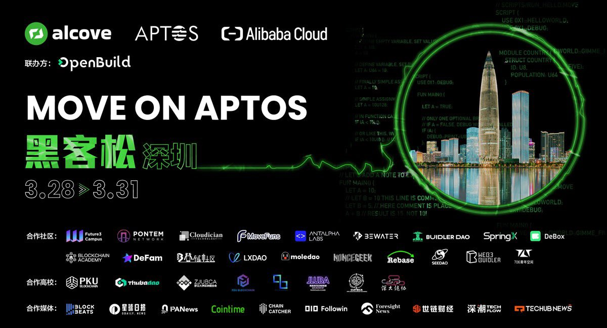

# Move On Aptos (线下)

# 简介

探索未知，挑战极限，引领未来的编码之旅即将启程！2024年3月28日至31日，由 alcove、Aptos、Alibaba Cloud 主办，OpenBuild 协办的 Move On Aptos Hackathon 将在深圳开启线下 Co-Building 之旅。

# 四大主题方向

### 💡 Web3 + AI 
区块链作为AI新基石

### 💡 DeFi
安全与创新并进

### 💡 社交创新
去中心化社交网路的新典范

### 🎲 Aptos Randomness
Aptos创新且独特的链上隨機性

# 往届黑客松部分应用

### MyLegacy:
「MyLegacy」致力于解决财富产权代际传承难题，重构数字时代的财富产权传承信任体系。通过构建在Starcoin公链上的区块链合约，为被财产继承提供公开透明的解决方案，实现资产安全存储、分批解锁，委托传承给受益人。

### Atlaspad:
Atlaspad是一个基于Starcoin网络的去中心化、无需许可和可互操作的环境中筹集资金、构建社区的协议。

### 红包:
红包是常用的生活工具。通过Move智能合约定义一个安全的资产SHIBA，并针对SHIBA设计了有意思的红包逻辑。发布到Starcoin链上，为大家提供一个链上拼手气的红包功能。

### Mars&Earth:
去中心化拍卖场景，有拍卖人和买受人，拍卖人创建拍卖并抵押标的物，并等待开拍。有人参与竞拍并达到起拍价且拍卖时间到则拍卖成功，否则拍卖失败。

### staratlas:
基于Starcoin链的区块浏览器。
