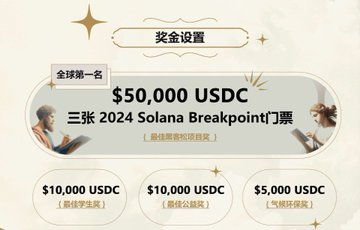
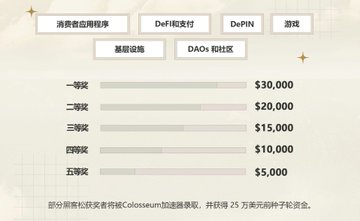
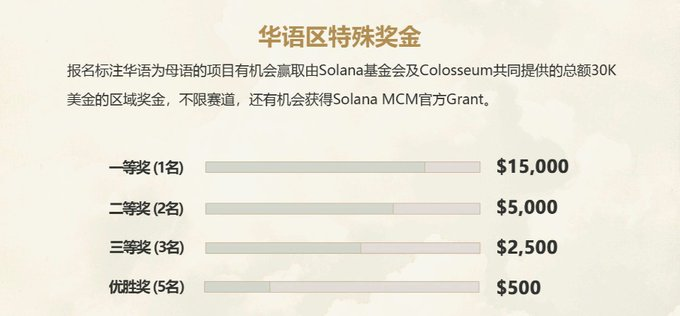

# Solana 黑客松

# 简介

由 ColosseumOrg 主办的 solana 2024年第一场全球线上黑客松 Renaissance 正式开赛！ 

报名入口: https://www.colosseum.org/renaissance

在注册时选择华语为主要语言或选择区域为大中华区（内地，香港，澳门，台湾）即可获得华语区参赛者区域奖金资格

⏰ 作品提交时间： 3月4日 - 4月8日 

🏆 5大赛道，线上提交，100万美金总奖金，获奖者更有机会获得 ColosseumOrg 深度孵化及25万美金投资 

# 奖项

<!--  -->

# 往届黑客松获奖部分应用

## 👛  消费者应用程序

### Paytel: 
一个建立在 Telegram 上的钱包机器人，利用其超过 10 亿用户的庞大用户群。我们提供直观且用户友好的界面和简化的流程。借助 Paytel，Web2 用户可以轻松创建自己的区块链钱包。我们专注于Telegram社交生态系统，并开发了Lucky Money Envelope和One-Dollar Auction等令人兴奋的应用程序，扩展了用户的社交体验。

### EventDApp:
一个去中心化的活动管理平台，允许组织者创建、管理和推广活动、销售门票并确保透明的资金管理，同时提供安全和用户友好的体验。
     
### MessageFi:
 一个基于 Solana 的信息和创建平台。它帮助用户在社区内以更实惠的方式共享信息，而无需担心信息的安全性和可靠性。用户还可以参加公开透明的比赛，赢取奖励并获得追随者。MessageFi 是粉丝社区经济的一种形式。

### Friend3:
 一款领先的社交 dApp，任何人都可以在 Web3 世界中结交朋友并获利。通过提供可定制的按组付费社区和引入去中心化捐赠机制来彻底改变社交货币化格局。这为内容创作者提供了直接的经济激励，从而完成了创作者经济的生态循环。

### SolanaForm: 
用户可以使用阿里巴巴的开源表单设计器自行设计表单，将表单结构和相关功能部署到链上，然后通过链上合约提交表单数据。收集的数据通过链下服务的用户界面显示。

## 💳  DeFi及支付

### Tipto:
将 solana 上的资产提示给任何可以随时领取资产的 Twitter 帐户。

### CBIndex:
作为链上加密投资和资产管理的一站式工具包和多链协议，CBIndex提供了基于CBI协议的各种加密投资工具，为个人和实体管理和增长其加密资产营造了一个创新的环境。CBIndex 包含一套全面的工具，使用户能够通过各种工具获得前所未有的加密投资，例如复制投资、主动管理的链上基金和链上指数基金。它提供了一个民主化的生态系统，任何人都可以通过复制经验丰富的投资者或参与主动型和指数基金来毫不费力地做出加密投资决策。使用 CBIndex 模拟器，人们可以在模拟良好的环境中尝试、学习和实践加密投资。使用索引工具，任何人都可以通过构建、管理和推广他们的加密指数来成为加密指数提供商。

### MM Bot on Phoenix:
做市是市场中性策略，旨在为订单簿注入流动性。自动做市策略对于确保订单簿厚厚非常重要，即使是大订单的执行价格也接近公平价格，从而降低影响成本和波动性。

### OmniBTC:
全链 defi 平台，支持跨多虚拟机生态系统构建的跨链交换和跨链借贷。目标是连接所有链上流动性，以实现无缝和低成本的跨链交易。在 OmniBTC 中，可以一键将 Solana 上的任何代币换成任何其他链上的任何其他代币。

### MessageFi:
基于 Solana 的信息和创建平台。它帮助用户在社区内以更实惠的方式共享信息，而无需担心信息的安全性和可靠性。用户还可以参加公开透明的比赛，赢取奖励并获得追随者。MessageFi 是粉丝社区经济的一种形式。

## 🔧  基础设施赛道

### Cyb3rliving:
社区驱动的房屋租赁项目。去中心化的Airbnb。

### ARTTOO network:
针对传统实体艺术品的碎片化交易平台。实体艺术品收藏家可以通过以 NFT 的形式出售一定比例的艺术品来增加其投资组合的流动性，这也允许公众从事通常具有非常高进入门槛的传统艺术品投资。ARTTOO还开展了名为ARTTOO众筹的艺术教育计划，该计划允许艺术家以跨平台用户的规模资助和创作他们的项目（主要是公共艺术）。

### Amphitheatre for Solana:
一个开源开发人员平台，旨在帮助开发人员在云中快速启动新的自动化开发环境。它提供按需预配置的工具、库和依赖项，确保您可以立即开始编码。您可以在本地编辑您的应用程序源代码，Amphitheatre 会自动将您的更改增量部署到 Kubernetes 集群，使本地开发和远程部署之间的过渡更顺畅、更高效。作为对 Solana 的特殊支持，Amphitheatre 为 Solana 项目提供了以下支持：用 Native、Anchor、Seahorse、C 和 C++ 编写的链上程序，以及 Solang 编程语言或框架。此外，测试网会自动部署在本地（可选）

### Wehealth:
一款主动健康 Web3 生活方式应用程序。内置 AI、Game-Fi 和 Social-Fi 元素，将健康的生活方式与代币激励有效结合。通过可穿戴设备（智能手表、腕带等），建立人们运动、睡眠、压力的自托管生活数据钱包，通过Game-Fi和AI数据分析，目标是推动数百万人走向更健康的生活方式和应对气候变化，通过Social-Fi建立健身健康社交平台，将Web 3.0与更广泛的受众连接起来， 推动 Web3 的大规模采用。

### Dev Wallet:
一个面向开发人员的 solana 钱包，具有开发人员可能需要的所有功能。这个钱包目前只能连接到测试网.

## 🎮 游戏赛道

### upchain-snake:
一款完全集成区块链的游戏，融合了丰富的区块链元素。

### Game2049:
一个小游戏平台，以其创新的经济模型设计和卓越的兼容性而闻名，让全球用户能够公平、公开地玩众多经典小游戏。它还为顶级玩家提供丰厚的奖励。

### LearningLangDapp:
为缺乏高质量的育儿知识共享提供可靠且可访问的解决方案

### web3event:
一个全球性的 Web3 活动平台。让每个人都能轻松找到 web3 活动。目前我们拥有最多的web3事件数据，超过3000+事件，覆盖300+城市。我们吸引了来自全球城市的 18,000+ 用户来探索 web3 活动

### BicycleH:
通过我们创新的去中心化应用程序走向未来，这将彻底改变自行车社区。让我们来探索 Solana 区块链的潜力，以及它如何改善您的骑行体验。

## 🧑‍🤝‍🧑 DAOs和社区赛道 

### kirby: 
提供通过 OPML 源文件订阅 RSS 的功能。任何人都可以上传自己的 RSS OPML 文件来启动订阅功能。未来，它还将集成RSS阅读器功能，允许直接阅读订阅的RSS用户的内容。

### Auto Grow:
使用马丁格尔策略帮助用户创建池，用户可以在其中存入他们的硬币，而不必担心货币价格下跌造成的资产损失。

### Donate3-Solana:
一项公共产品，用于在 Solana Network 上向他人捐款。它使公共产品和创作者能够在短短 5 分钟内设置捐款，并且可以轻松集成网站或文章.

### THUBA:
借助 Web3 Assembly，社区中具有不同角色的每个人都可以创建、投票和设计学习任何知识主题的最佳方式 Web3Assembly 不是另一个维基百科。我们希望确保您所依赖的信息是精简和值得信赖的，因此我们引入了知识树的共识机制 - 社区决定学习什么和 NEXT，众包最佳和最快的学习路线。

### Power Voting:
利用 Drand Timelock、StorSwift ZK-KYC 和 Subgraphs 技术来实现公平和私密的投票。在投票截止日期之前，其他人不会看到任何人的投票结果，投票过程不会受到其他参与者投票结果的干扰。投票截止日期后，任何人都可以以去中心化的方式计票，计票结果将由智能合约执行和存储，不会被任何中心化组织或个人操纵。Power Voting dApp 旨在成为 DAO 治理的基础设施。

